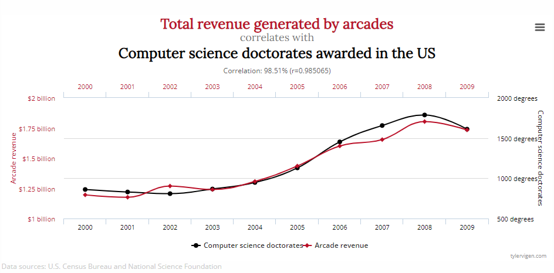
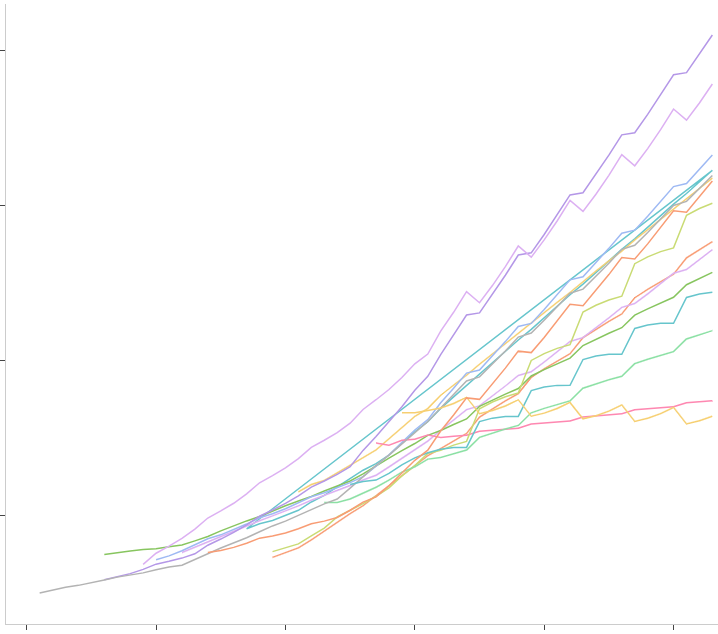
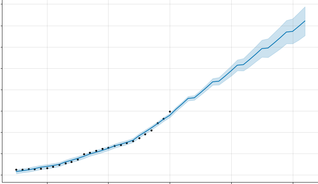

# Data Science & Analytics

New North High School Hackathon 2021

## Data Science

What is data science?

Data science can mean any and all of several areas involving data:

* Preparation
* Modeling
* Analysis
* AI & Machine Learning

 Where do you see data science involved in your own lives? Do you need to use it?

## Tradeoffs

Do you like to compare your options and weight the benefits and drawbacks of your choices? How did you decide what you would eat for dinner yesterday?

### Causation vs Correlation

Your job will require you to breakdown information and options for business leaders. A major part of that involves distilling truth from fiction.

### AI & Machine Learning

Make a computer work and behave like a human does. What makes people different from programs and computers?

**Finite potential.**

A machine is limited by the functions programmed into it, restricting choice and flexibility.

### Us vs Computers

People worry that robots will take over jobs in the future, but the world will always need people and their **ideas**.

## Real World Expectations vs Reality

Data in the real world is messy and the default is not clean.

We want data to be understandable and digestable. Something more like:

Or neatly arranged and understandable:

### Organize and Simplify

Master these skills in every field you enter.

## Time

Your greatest and most limited resource in life is time. You will need to learn how to prioritize, make hard choices, and say no many times in your career and life.

## Advice

* Write your ideas
* Become an expert at thinking and learning

_Disclaimer: I will update images when I find better ones!_

## Example Project

Get and idea of what data preperation and visualization can look like in a Tableau Dashboard ([US Agriculture data](https://github.com/mklim26/us-agriculture)).
